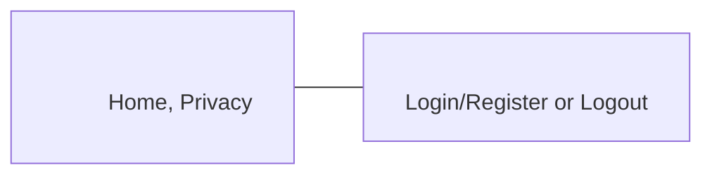

# Authentication (ASP.NET Core MVC + Identity)

Bu proje, ASP.NET Core MVC ile kimlik doğrulama (Authentication) sistemini adım adım kurar: kullanıcı kayıt (Register), giriş (Login), çıkış (Logout), e-posta doğrulama (Verify Email) ile şifre değiştirme (Change Password).

## İçindekiler

- Genel Bakış
- Mimari (MVC)
- Kurulum ve Çalıştırma
- Veritabanı ve Migrations
- Identity Yapılandırması
- Model ve ViewModel'ler
- Akış (Kullanıcı Yolculuğu)
- Controller Mantığı
- Görünümler (Views)
- Sorun Giderme
- Faydalı Komutlar

---

## Genel Bakış

Proje, aşağıdaki ana bileşenlerle bir kimlik doğrulama sistemi sağlar:

- Kullanıcı modeli: `Models/Users.cs` (`IdentityUser` türevi, ekstra `FullName` alanı)
- Veritabanı bağlamı: `data/AppDbContext.cs` (`IdentityDbContext<Users>`)
- Kimlik servisleri: `Program.cs` içinde `AddIdentity<Users, IdentityRole>()`
- İş mantığı: `Controllers/AccountController.cs`
- Form veri modelleri: `ViewModels/*ViewModel.cs`
- Sayfalar: `Views/Account/*.cshtml`, layout: `Views/Shared/_Layout.cshtml`

---

## Mimari (MVC)

```
Authentication/
├── Controllers/          → İş mantığı ve yönlendirme
│   └── AccountController.cs
├── Models/               → Veritabanı tablolarının temsili
│   └── Users.cs
├── ViewModels/           → Form/veri doğrulama sınıfları
│   ├── LoginViewModel.cs
│   ├── RegisterViewModel.cs
│   ├── VerifyEmailViewModel.cs
│   └── ChangePasswordViewModel.cs
├── Views/                → HTML/Razor sayfaları
│   └── Account/
│       ├── Login.cshtml
│       ├── Register.cshtml
│       ├── VerifyEmail.cshtml
│       └── ChangePassword.cshtml
├── data/                 → EF Core DbContext
│   └── AppDbContext.cs
├── Program.cs            → Servis ve middleware yapılandırması
└── appsettings.json      → Bağlantı metinleri ve genel ayarlar
```

Akış Diyagramı (Özet)

```
Kullanıcı → Register → Login → (giriş) → Logout
                 │
                 └→ VerifyEmail → ChangePassword → Login
```

### Görsel Diyagramlar (Mermaid)

```mermaid
flowchart TD
      A[Visitor] --> B[/Account/Register]
      B -->|POST: Valid| C[Create User]
      C --> D[/Account/Login]
      D -->|POST: Valid| E[SignIn (Cookies)]
      E --> F[Home/Index]
      F --> G[/Account/Logout]
      G --> H[SignOut]
      H --> F
      D -->|POST: Invalid| D
      B -->|POST: Invalid| B

      F --> I[/Account/VerifyEmail]
      I -->|POST: Found| J[/Account/ChangePassword]
      I -->|POST: Not Found| I
      J -->|POST: RemovePassword + AddPassword| D
```

Katmanlı mimari görünümü:

```mermaid
graph LR
   UI[Views (.cshtml)] --> CTRL[Controllers]
   CTRL --> VM[ViewModels]
   CTRL --> SVC[Identity Services\nUserManager / SignInManager]
   SVC --> DB[(SQL Server)]
   CTRL --> DC[DbContext (EF Core)]
   DC --> DB
   MODEL[Users (IdentityUser)] --> DC
   STYLE[Styles/Bootstrap] --> UI
```

---

## Kurulum ve Çalıştırma

1. Gerekli paketler (eklenmiş olmalı):

- `Microsoft.AspNetCore.Identity.EntityFrameworkCore`
- `Microsoft.EntityFrameworkCore.SqlServer`
- `Microsoft.EntityFrameworkCore.Tools`

2. Bağlantı dizesi (`appsettings.json`):

```
{
  "ConnectionStrings": {
    "DefaultConnection": "Server=DESKTOP-V7FS6HJ\\SQLEXPRESS;Database=UserApp;Trusted_Connection=True;TrustServerCertificate=True"
  }
}
```

Not: `\\` çift ters eğik çizgi JSON kaçış kuralı içindir.

3. Uygulamayı çalıştırın:

```bash
dotnet run
```

Tarayıcıda: `https://localhost:xxxx`

### Ekran Görüntüleri (Örnek)

- Login: 
- Register: 
- Verify Email: 
- Change Password: 

İpucu: Görseller yoksa `wwwroot/images` klasörü altında bu dosya adlarıyla ekran görüntüleri ekleyebilirsiniz.

---

## Veritabanı ve Migrations

EF Core CLI (gerekirse kurun):

```bash
dotnet tool install --global dotnet-ef
```

Migration oluşturma ve veritabanını güncelleme:

```bash
dotnet ef migrations add InitialCreate
dotnet ef database update
```

SQL Server servisleri:

- `SQL Server (SQLEXPRESS)` çalışıyor olmalı
- `SQL Server Browser` devre dışıysa, `services.msc` → Startup `Automatic` → Start

---

## Identity Yapılandırması (`Program.cs`)

```csharp
builder.Services.AddDbContext<AppDbContext>(options =>
    options.UseSqlServer(builder.Configuration.GetConnectionString("DefaultConnection")));

builder.Services.AddIdentity<Users, IdentityRole>(options =>
{
    options.Password.RequireNonAlphanumeric = false;
    options.Password.RequiredLength = 8;
    options.Password.RequireUppercase = false;
    options.Password.RequireLowercase = false;
    options.User.RequireUniqueEmail = true;
    options.SignIn.RequireConfirmedAccount = false;
    options.SignIn.RequireConfirmedEmail = false;
})
.AddEntityFrameworkStores<AppDbContext>()
.AddDefaultTokenProviders();
```

- `UserManager<Users>`: kullanıcı oluşturma/bulma/şifre işlemleri
- `SignInManager<Users>`: giriş/çıkış işlemleri

---

## Model ve ViewModel'ler

### Kullanıcı Modeli (`Models/Users.cs`)

```csharp
public class Users : IdentityUser
{
    public string FullName { get; set; }
}
```

### RegisterViewModel

- `[Required]`, `[EmailAddress]`, `[StringLength]`, `[Compare]` gibi annotation'larla doğrulama

### LoginViewModel

- `Email`, `Password`, `RememberMe`

### VerifyEmailViewModel

- Şifre değiştirme akışında e-posta doğrulaması

### ChangePasswordViewModel

- `Email` (hidden input ile formda taşınır)
- `newPassword`, `ConfirmNewPassword` (karşılaştırma ile doğrulama)

---

## Akış (Kullanıcı Yolculuğu)

```
1) Register
   GET  → Formu göster
   POST → Kullanıcıyı oluştur, başarılıysa Login'e yönlendir

2) Login
   GET  → Formu göster
   POST → PasswordSignInAsync; başarılıysa Home/Index

3) Logout
   POST/GET → SignOutAsync ve Home/Index'e dönüş

4) Şifre Değiştirme (2 adım)
   a) VerifyEmail
      - E-posta girilir, kullanıcı bulunursa ChangePassword sayfasına yönlendirilir
   b) ChangePassword
      - Email hidden input ile post edilir
      - RemovePasswordAsync → AddPasswordAsync
      - Başarılıysa Login'e yönlendirilir
```

ASCII Akış Şeması:

```
Kullanıcı
  ├─ /Account/Register (GET/POST)
  │     └─ userManager.CreateAsync → Login
  ├─ /Account/Login (GET/POST)
  │     └─ signInManager.PasswordSignInAsync → Home/Index
  ├─ /Account/Logout (POST)
  │     └─ signInManager.SignOutAsync → Home/Index
  └─ /Account/VerifyEmail (GET/POST)
        └─ userManager.FindByNameAsync → ChangePassword
             └─ /Account/ChangePassword (GET/POST)
                   └─ RemovePasswordAsync → AddPasswordAsync → Login
```

### Navbar Yerleşimi (Bootstrap görseli)



---

## Controller Mantığı (`Controllers/AccountController.cs`)

Önemli metotlar:

- `Register()`: yeni kullanıcıyı oluşturur (`UserName = Email`)
- `Login()`: `PasswordSignInAsync` ile giriş yapar
- `Logout()`: `SignOutAsync` ile çıkış yapar
- `VerifyEmail()` → `ChangePassword` yönlendirmesi
- `ChangePassword()` (GET/POST): email gizli alanla taşınır, şifre güncellenir

Kritik noktalar:

- `ChangePassword.cshtml` içinde `Email` değeri hidden input ile post edilmelidir:

```html
<input type="hidden" asp-for="Email" />
```

---

## Görünümler (Views)

- `_Layout.cshtml` navbar içinde `partial` doğru konumda olmalı:

```html
<ul class="navbar-nav flex-grow-1">
  ...
</ul>
<partial name="_LoginPartial" />
```

- `_LoginPartial.cshtml`: giriş durumuna göre Login/Register veya Logout gösterir
- `Views/Account/*.cshtml`: ilgili formlar ve doğrulama özetleri (`asp-validation-summary`)

---

## Sorun Giderme

- Hata: `ConnectionString not initialized` → `Program.cs` ile `DefaultConnection` adı uyuşmalı
- Hata: `SQL Network Interfaces, error: 26` → SQL Server servisleri çalışmalı, server adı doğru olmalı (`\\` kaçışı)
- `NullReferenceException` (ChangePassword POST) → `Email` formdan hidden input ile post edilmeli
- Login/Register görünmüyor → `_LoginPartial` navbar `<ul>` dışında konumlandırılmalı ve `AccountController` namespace'i `Authentication.Controllers` olmalı
- EF komutları bulunamıyor → `dotnet-ef` global tool yüklü olmalı

---

## Faydalı Komutlar

```bash
# Paket ekleme
dotnet add package Microsoft.AspNetCore.Identity.EntityFrameworkCore
dotnet add package Microsoft.EntityFrameworkCore.SqlServer
dotnet add package Microsoft.EntityFrameworkCore.Tools

# EF Core araçları
dotnet tool install --global dotnet-ef

# Migration ve DB update
dotnet ef migrations add InitialCreate
dotnet ef database update

# Çalıştırma
dotnet run

# Kod üreteci ile Controller
dotnet aspnet-codegenerator controller -name AccountController -outDir Controllers
```

---

## Git ve .gitignore

- `.gitignore` dosyası `bin/`, `obj/`, `.vs/` gibi gereksiz dosyaları dışlar
- Push akışı:

```bash
git add .
git commit -m "Add README and auth setup docs"
git push origin main
```

---

## İpuçları

- `UserName` olarak `Email` kullanmak sade bir deneyim sağlar
- `Password` kurallarını `Program.cs` içinde ihtiyaca göre sıkılaştırabilirsiniz
- Üretimde `RequireConfirmedEmail = true` yapmanız güvenliği artırır
